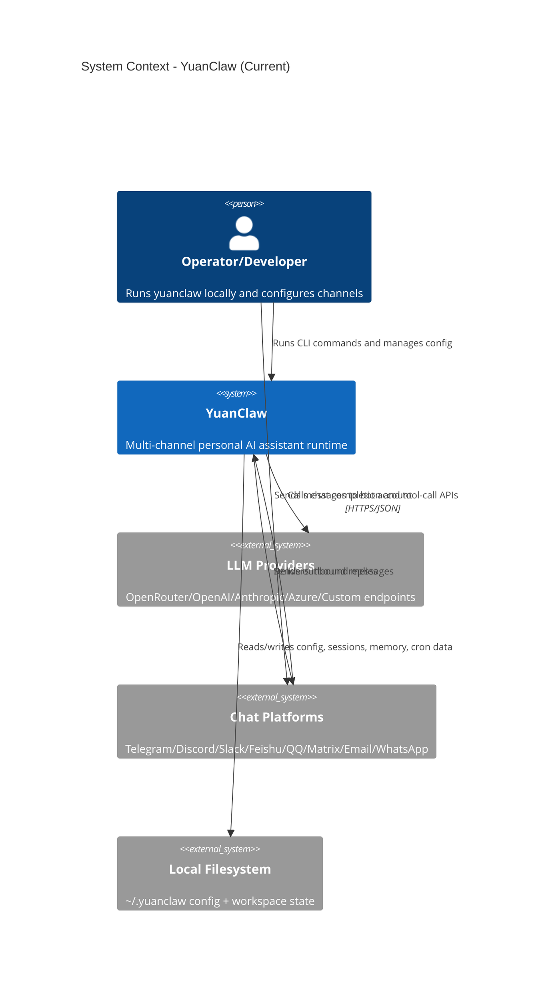
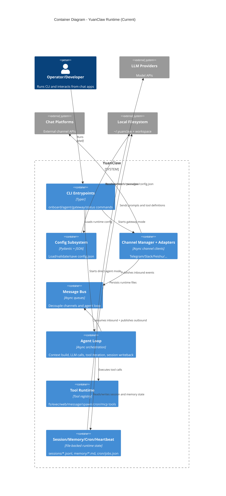

# YuanClaw 当前架构背景（Living Doc）

- 文档版本: `v0`
- 最后更新: `2026-03-10`
- 面向对象: 后续接手开发的 AI / 开发者
- 维护规则: 任何影响模块边界、核心链路、运行时目录的变更，都要同步更新本文件

## 1. 目标与边界

YuanClaw 当前阶段是对 `nanobot main` 的架构镜像式复刻，原则是:
- 尽量保留原有模块分层与运行链路
- 品牌与命名统一为 `yuanclaw`
- 仅保留 `yuanclaw` 命令，不保留 `nanobot` 兼容别名
- 配置目录走全新路径 `~/.yuanclaw`，不自动迁移旧 `~/.nanobot`

本文件描述的是“当前实现态”，不是未来规划图。

## 2. C4 Context（系统上下文）

## 3. C4 Container（容器级）

## 4. 关键运行链路

### 4.1 Gateway 模式（多渠道）
1. `python -m yuanclaw gateway`
2. CLI 读取配置，创建 `MessageBus`、`AgentLoop`、`ChannelManager`、`CronService`、`HeartbeatService`
3. 渠道把入站消息写入 `inbound queue`
4. `AgentLoop` 消费消息，构建上下文（系统提示 + 历史 + memory + skills）
5. 调用 LLM，按需执行工具，最终把结果写入 `outbound queue`
6. `ChannelManager` 分发到对应渠道回复

### 4.2 Agent 直连模式（CLI）
1. `python -m yuanclaw agent -m "<message>"` 直接走 `process_direct`
2. 同样经过 `AgentLoop`（上下文/工具/会话持久化），但不依赖外部渠道

### 4.3 定时与心跳
- `CronService`: 管理 `cron/jobs.json`，到点触发任务并交给 `AgentLoop`
- `HeartbeatService`: 周期读取 `HEARTBEAT.md`，先做“是否执行”决策，再触发 agent 执行

## 5. 代码结构地图（当前）

| 目录 | 责任 | 关键文件 |
|---|---|---|
| `yuanclaw/cli` | 命令入口与运行编排 | `commands.py` |
| `yuanclaw/channels` | 渠道适配层（入站/出站） | `manager.py`, `telegram.py`, `base.py` |
| `yuanclaw/bus` | 入站/出站异步消息队列 | `events.py`, `queue.py` |
| `yuanclaw/agent` | 核心 loop、上下文、工具调度、memory consolidation | `loop.py`, `context.py` |
| `yuanclaw/agent/tools` | 工具实现与注册 | `registry.py`, `*.py` |
| `yuanclaw/providers` | LLM Provider 抽象和实现 | `base.py`, `litellm_provider.py`, `registry.py` |
| `yuanclaw/config` | 配置 schema 与加载路径 | `schema.py`, `loader.py`, `paths.py` |
| `yuanclaw/session` | 会话持久化（JSONL） | `manager.py` |
| `yuanclaw/cron` | 定时任务调度 | `service.py` |
| `yuanclaw/heartbeat` | 周期唤醒机制 | `service.py` |
| `yuanclaw/templates` | 工作区模板（AGENTS/SOUL/USER/TOOLS 等） | `*.md` |
| `scripts` | 本地开发辅助脚本 | `bootstrap_dev_env.sh`, `reference_repo.sh`, `setup_yuanclaw_config_from_nanobot.sh` |

## 6. 运行时数据与目录

- 全局配置: `~/.yuanclaw/config.json`
- 默认工作区: `~/.yuanclaw/workspace`
- 会话: `~/.yuanclaw/workspace/sessions/*.jsonl`
- 长期记忆: `~/.yuanclaw/workspace/memory/MEMORY.md`
- 历史日志: `~/.yuanclaw/workspace/memory/HISTORY.md`
- 定时任务: `~/.yuanclaw/cron/jobs.json`（由 `config.paths` 派生）

## 7. 当前约束（给后续 AI）

- `_reference_repo/` 只允许作为本地参考目录，且必须保持未跟踪（gitignore）。
- 分支约束:
  - `dev` 可本地使用 `_reference_repo`
  - `main`/`uat` 不应包含 `_reference_repo` 的受控内容
- 项目策略:
  - 不提供 `nanobot` CLI 兼容命令
  - 不自动迁移 `~/.nanobot`，YuanClaw 使用独立新配置
  - import shuffle 规范覆盖 `tests/`

## 8. 给后续开发 AI 的建议阅读顺序

1. `docs/engineering/governance/folder-declaration-v0.md`（分支与目录政策）
2. `docs/engineering/operations/deployment-v0.md`（配置与部署入口）
3. `yuanclaw/cli/commands.py`（运行时装配主入口）
4. `yuanclaw/agent/loop.py`（核心执行循环）
5. `yuanclaw/channels/manager.py` + `yuanclaw/providers/registry.py`（可扩展点）

---

如果后续新增 GUI、服务拆分、或跨进程调度，请在本文件追加新的 C4 图，而不是覆盖当前实现图。
