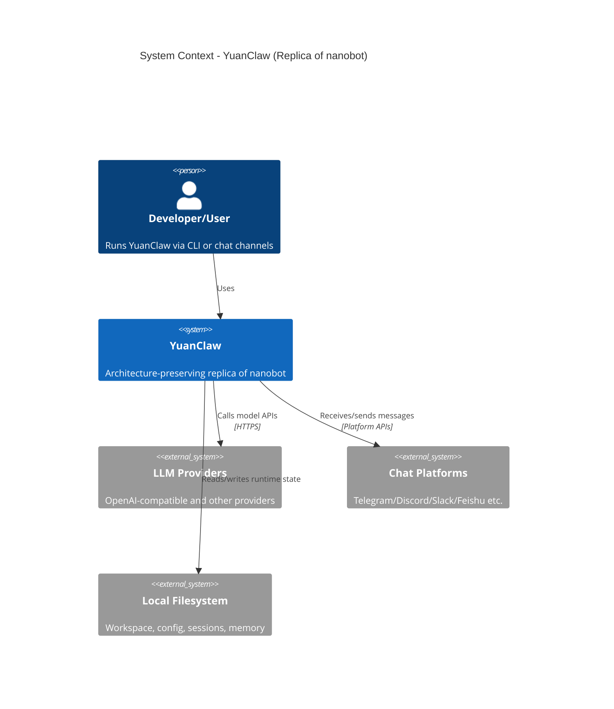
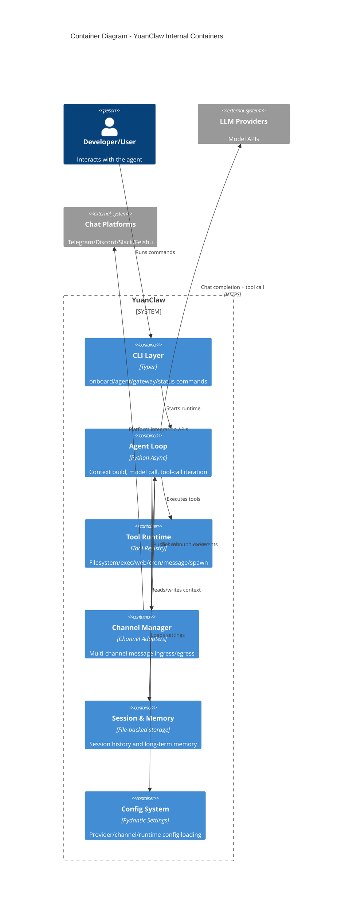

# DesignDoc V0 - YuanClaw Architecture-Preserving Replica of Nanobot

## Background
你给出的新目标是：
1. 尽量保留 nanobot 原项目架构。
2. 将所有 `nanobot` 相关命名替换为 `yuanclaw`。
3. 对代码中的 import 顺序进行全仓 shuffle。

因此 V0 不再是“最小功能重做”，而是“架构镜像式复刻”：先把 nanobot 的工程组织、模块边界、运行链路整体迁移到 YuanClaw，再进行品牌/命名替换与代码风格扰动（import shuffle）。

## Scope
### In Scope (V0)
1. 保留 nanobot 原目录与模块分层（`agent/bus/channels/cli/config/cron/heartbeat/providers/session/utils/skills/templates`）。
2. 包命名全量替换：`nanobot.*` -> `yuanclaw.*`。
3. CLI 与发行元信息替换：
- 可执行命令名：`nanobot` -> `yuanclaw`
- 包名：`nanobot-ai` -> `yuanclaw-ai`
- 文案、logo、状态输出中的 nanobot 文本替换
4. 配置/运行目录替换：
- `~/.nanobot` -> `~/.yuanclaw`
5. 明确不提供 `nanobot` CLI 兼容别名，仅保留 `yuanclaw`。
6. 明确不迁移历史配置，`yuanclaw` 首次运行时新建独立配置。
7. import 顺序 shuffle（全仓执行，含 `tests/`）。
8. 保持功能行为等价（除命名替换与 import 顺序变化外）。

### Out of Scope (V0)
1. 新增业务能力或新架构。
2. 对原有模块进行合并/拆分重构。
3. 改写 provider/channel 设计。
4. 引入与 nanobot 不一致的运行模式。

## Architecture / Workflow
### C4 Context (Level 1)

### C4 Container (Level 2)

### Source-to-Target Structural Mapping
| nanobot source | YuanClaw target |
|---|---|
| `nanobot/agent/**` | `yuanclaw/agent/**` |
| `nanobot/bus/**` | `yuanclaw/bus/**` |
| `nanobot/channels/**` | `yuanclaw/channels/**` |
| `nanobot/cli/**` | `yuanclaw/cli/**` |
| `nanobot/config/**` | `yuanclaw/config/**` |
| `nanobot/cron/**` | `yuanclaw/cron/**` |
| `nanobot/heartbeat/**` | `yuanclaw/heartbeat/**` |
| `nanobot/providers/**` | `yuanclaw/providers/**` |
| `nanobot/session/**` | `yuanclaw/session/**` |
| `nanobot/utils/**` | `yuanclaw/utils/**` |
| `nanobot/skills/**` | `yuanclaw/skills/**` |
| `nanobot/templates/**` | `yuanclaw/templates/**` |

## Rename + Import Shuffle Strategy
### A. 全量命名替换（`nanobot` -> `yuanclaw`）
1. 目录名、包名、入口点、脚本名、CLI command、配置目录常量、日志命名空间统一替换。
2. 文案替换范围：
- README/文档中的产品名
- CLI 输出中的品牌名
- 安装提示命令中的包名
3. 替换后必须满足：
- `python -m yuanclaw` 可运行
- `yuanclaw` CLI 命令可运行
- 无残留 `from nanobot ...` 或 `import nanobot ...`

### B. Import 顺序 Shuffle（全仓）
1. 原则：只改 import 排序，不改语义。
2. 必须保留的约束：
- 模块 docstring 在最前。
- `from __future__ import ...` 必须保持在最顶部合法位置，不参与 shuffle。
- 明显依赖导入顺序的文件加入 skip-list（手工豁免）。
3. 执行方式：
- 用脚本对每个 Python 文件做“确定性 shuffle”（同一文件每次结果一致，便于复现）。
- 覆盖范围包含业务代码与 `tests/` 目录。
- shuffle 后执行 lint + tests + 启动冒烟，失败则自动回滚到该文件原排序。

## Milestones
1. M1 - 结构镜像迁移（2 天）
- 完成代码树拷贝与路径映射
- 验收：`yuanclaw/*` 目录结构与 nanobot 对齐

2. M2 - 命名替换闭环（2 天）
- 完成包名/入口/配置路径/文案替换
- 验收：`python -m yuanclaw` 与 `yuanclaw --help` 可运行

3. M3 - Import Shuffle 执行（1-2 天）
- 对全仓执行 import shuffle + 豁免机制
- 验收：无语法错误，关键命令冒烟通过

4. M4 - 等价性验证（2 天）
- 关键路径对照测试（CLI、agent loop、tool call、session/memory）
- 验收：行为与 `nanobot main` 对齐（允许品牌命名差异）

## Risks and Mitigations
1. 风险：全量替换遗漏导致运行时仍引用 `nanobot`。  
缓解：增加静态扫描门禁（禁止 `import nanobot` 字符串残留）。

2. 风险：import shuffle 触发隐式顺序依赖。  
缓解：`__future__` 保序、skip-list、失败自动回滚机制。

3. 风险：路径替换后，用户误以为会自动继承旧配置。  
缓解：明确产品策略为“完全不迁移旧配置”，首次启动创建全新 `~/.yuanclaw`，并在 onboarding 文档中显式说明。

4. 风险：复刻后可维护性下降。  
缓解：先保证“可运行等价”，后续再通过 optimize design doc 做结构清理。

## Decisions (Locked for V0)
1. CLI 不保留 `nanobot` 兼容别名，仅支持 `yuanclaw`。
2. 配置目录不迁移：保留历史 `~/.nanobot`，`yuanclaw` 创建新的 `~/.yuanclaw`。
3. import shuffle 强制覆盖 `tests/` 目录。
4. 对齐基线为 `nanobot main`，不是历史发布版本 tag。
