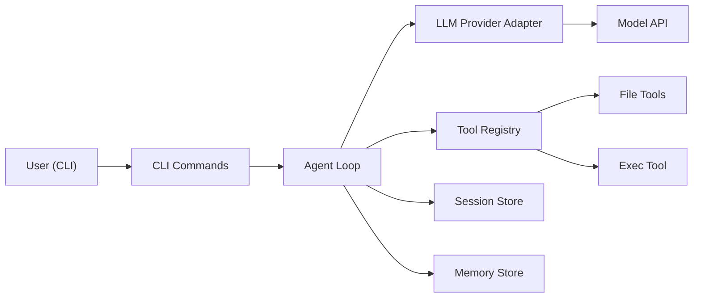

# DesignDoc V0 - Nanobot Basic Replica

## Background
YuanClaw 进入正式研发阶段，V0 目标是基于 `_reference_repo/nanobot` 的核心思想，先做一个可运行、可迭代、可验证的最小闭环版本，而不是一次性复刻全部能力。

我们将优先复刻 nanobot 的核心主链路：
- CLI 入口
- Agent Loop（LLM 调用 + Tool Call + 迭代）
- 最小工具集
- 会话与记忆持久化

通过该 V0 打通后，再逐步扩展到多渠道、多 Provider、MCP 等增强能力。

## Scope
### In Scope (V0)
1. 运行形态：本地 CLI 单通道交互。
2. LLM 适配：1 个 OpenAI-compatible Provider（统一接口，后续可扩展）。
3. Agent Core：
   - 消息循环与多轮 tool-calling
   - 最大迭代次数与错误兜底
4. Tooling（最小集）：
   - 文件工具：`read/write/edit/list`
   - Shell 工具：`exec`（带超时与工作目录限制）
5. 状态持久化：
   - Session 历史
   - Memory 双层文件（`MEMORY.md` + `HISTORY.md`）的简化版
6. 基础可观测性：
   - 结构化日志
   - 错误路径可定位

### Out of Scope (V0)
1. 多聊天渠道（Telegram/Discord/Slack/Feishu 等）。
2. MCP servers 集成。
3. 子代理（Subagent）并发编排。
4. 复杂权限策略（先做基础安全边界）。
5. 完整插件/技能市场能力。

## Architecture / Workflow
### High-level Flow

### Component Design
1. `cli/commands`  
职责：启动、配置加载、交互输入输出、触发 agent run。  
原则：保持薄层，仅做参数解析和 I/O 编排。

2. `provider/base` + `provider/openai_compatible`  
职责：屏蔽不同模型 API 差异，统一返回：
- `content`
- `tool_calls`
- `finish_reason`

3. `agent/loop`  
职责：核心状态机，步骤为：
1) 拼装上下文  
2) 调用 LLM  
3) 解析 tool call 并执行  
4) 回填 tool 结果继续迭代  
5) 产出最终回复或失败兜底

4. `agent/tools`  
职责：工具注册、schema 暴露、统一执行。  
V0 仅保留文件和 shell 两类工具，确保闭环与安全边界可控。

5. `session` + `memory`  
职责：
- `session` 保存近期对话
- `memory` 汇总长期信息  
V0 先做可用性优先，memory consolidation 可先走简化策略（周期性归档 + 人工可读）。

### V0 安全边界
1. `exec` 默认限定在项目 workspace 下。
2. 设置命令执行超时（默认 60s，后续可配置）。
3. 对工具返回做长度截断，避免上下文污染与 token 爆炸。

## Milestones
1. M1 - Skeleton + CLI (1-2 天)
- 完成目录骨架与 `cli` 启动命令
- 完成基础配置加载（模型、key、workspace）
- 验收：可执行 `yuanclaw agent` 并完成一次无工具问答

2. M2 - Agent Loop + Provider (2-3 天)
- 完成统一 provider 接口
- 完成 agent loop 多轮 tool-calling
- 验收：模型可正确发起并消费至少 2 次 tool call

3. M3 - Core Tools + Persistence (2-3 天)
- 文件工具、exec 工具接入
- session + memory 基础持久化
- 验收：跨会话可读到历史/记忆；工具执行有日志可追踪

4. M4 - Hardening + Tests (2 天)
- 异常兜底、超时、空内容处理
- 补齐最小自动化测试
- 验收：关键路径测试通过，形成 V0 可演示版本

## Risks and Mitigations
1. 风险：不同模型返回 tool-call 格式不一致。  
缓解：在 provider 层做标准化转换，loop 层只消费统一结构。

2. 风险：exec 工具存在误操作风险。  
缓解：默认 workspace 限制 + 超时 + 命令白/黑名单（V0 先黑名单高危命令）。

3. 风险：上下文迅速膨胀导致成本和稳定性问题。  
缓解：控制 tool 结果长度、会话窗口裁剪、memory consolidation。

4. 风险：一开始复刻范围过大拖慢交付。  
缓解：严格执行 In/Out Scope，先交付 CLI 单通道最小闭环。

## Open Questions
1. V0 默认模型与供应商是否固定（例如 OpenAI 还是 OpenRouter）？
2. `exec` 工具在 V0 是否需要“默认关闭，按配置开启”？
3. memory consolidation 在 V0 是否要求 LLM 自动总结，还是先做规则归档？
4. V0 演示标准是“本地 CLI demo”还是“可部署服务 demo”？
