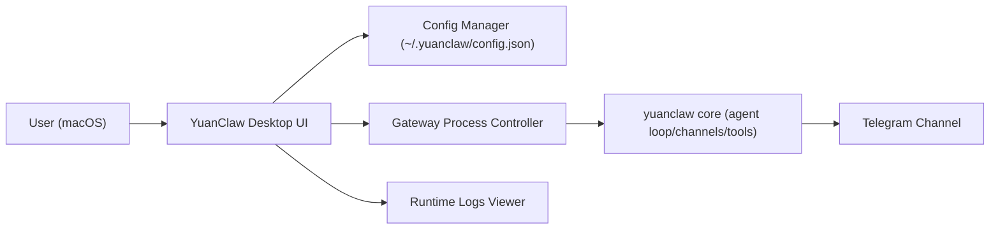

# DesignDoc V0.0.2 - Visual UI + macOS + Full Nanobot Mirror Rebuild

## Background
V0.0.2 的阶段目标：
1. 具备可视化界面（不是仅 CLI）。
2. 支持 macOS 本地可用（开发与运行都稳定）。
3. 完整镜像重构 nanobot。

当前状态判断：
- 目标 3（完整镜像重构）在当前分支已基本完成主干迁移（代码树、命名替换、基础可运行）。
- V0.0.2 的核心增量将放在“可视化界面 + macOS 交付质量”，同时补齐目标 3 的验收闭环。

## Scope
### In Scope (V0.0.2)
1. 可视化界面（Desktop First）
- 提供本地 GUI（首版聚焦单机桌面使用）。
- 功能范围：启动/停止网关、配置编辑、日志查看、Telegram 状态查看、基础会话视图。

2. macOS 支持（优先 Apple Silicon）
- 在 macOS 上一键安装/启动（至少开发版可直接跑通）。
- 明确依赖安装、权限要求、运行目录。
- 产出可执行的本地启动流程与故障排查清单。

3. 完整镜像重构验收闭环
- 对照 `nanobot main` 做模块完整性检查（目录、入口、核心链路）。
- 明确“已完成/未完成”清单，关闭镜像迁移遗留项。

### Out of Scope (V0.0.2)
1. Windows/Linux 打包交付。
2. 全平台安装器（`.dmg/.pkg` 正式发布流程可放 V0.0.3）。
3. 新增业务能力（多 agent 新玩法、复杂权限系统等）。

## Architecture / Workflow
### High-level

### Component Notes
1. Desktop UI Layer
- 承担可视交互，不承载核心 agent 逻辑。
- 调用本地进程控制接口启动 `python -m yuanclaw gateway`。

2. Process Controller
- 负责进程生命周期：start/stop/restart/status。
- 输出运行状态给 UI（启动中、运行中、失败、停止）。

3. Config Manager
- 读写 `~/.yuanclaw/config.json`。
- 提供关键字段可视编辑：provider、model、apiKey、telegram token、allowFrom、workspace。

4. Core Runtime
- 继续复用当前 `yuanclaw/*` 核心代码，不在 UI 层复制逻辑。

## Milestones
1. M1 - UI Skeleton + Process Control (2-3 天)
- 创建桌面 UI 骨架。
- 打通 “启动/停止/状态显示”。
- 验收：可从 UI 启停 gateway，并看到状态变化。

2. M2 - Config UI + Validation (2 天)
- 可视化编辑 `config.json`。
- 基础校验（必填项、空 allowFrom 提示等）。
- 验收：不改命令行即可配置并成功启动 Telegram。

3. M3 - macOS Hardening (2 天)
- 完成 macOS 运行依赖与环境文档。
- 验收：新机器按文档可在 30 分钟内跑通。

4. M4 - Full Mirror Audit (2 天)
- 对照 `nanobot main` 出迁移审计清单。
- 关闭未完成项，形成“镜像重构完成报告”。

## Risks and Mitigations
1. 风险：UI 与 core 逻辑耦合过深，后期难维护。  
缓解：UI 只做编排，核心逻辑全部留在 `yuanclaw/*`。

2. 风险：macOS 本地环境差异导致“我这能跑、你那不能跑”。  
缓解：固化依赖版本、增加启动前检查、提供标准故障排查命令。

3. 风险：目标 3 被“感觉完成”但缺乏可验证标准。  
缓解：新增 mirror audit checklist，按模块和行为逐项打钩验收。

4. 风险：Telegram 运行时配置问题频发（token、allowFrom、依赖冲突）。  
缓解：UI 内置配置校验与启动前预检（依赖、token、allowFrom）。

## Open Questions
1. 可视化界面技术栈优先级：Electron / Tauri / 纯 Web+本地服务？
2. V0.0.2 是否需要提供最小 `.app` 打包产物，还是先以开发态启动为准？
3. “完整镜像重构完成”是否要求自动化对比报告，还是手工 checklist 即可？
